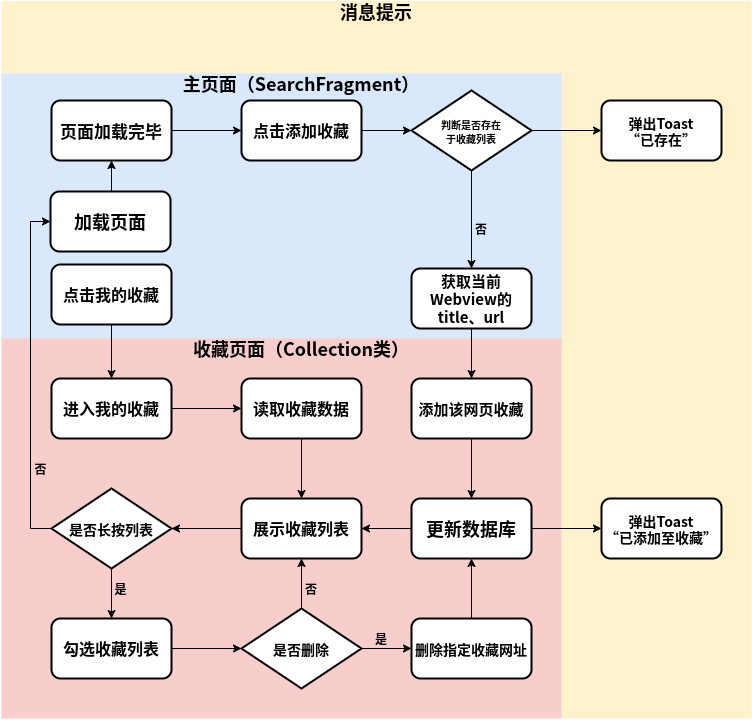
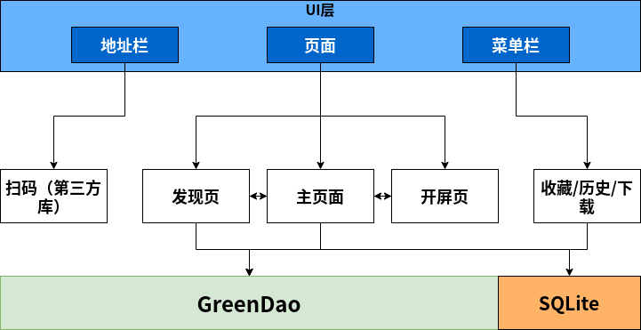

# MyBrowserDemo

## ——a simple Android browser(简易安卓浏览器)

------

### Functions

- Bookmarks
- History
- Register & Login
- Dark mode
- Incognito mode
- Multimedia
- Search & QR code Scan
- UA change

------

### Usage

Please run in AS.

Dependencies:

```
dependencies {
    //AndroidX 版本
    implementation 'com.github.jenly1314:zxing-lite:2.1.1'//二维码扫描
    implementation 'com.github.bumptech.glide:glide:4.8.0'//图片加载库
    annotationProcessor 'com.github.bumptech.glide:compiler:4.8.0'
    implementation fileTree(dir: "libs", include: ["*.jar"])
    implementation 'com.github.chrisbanes:PhotoView:2.0.0'
    implementation 'org.greenrobot:greendao:3.3.0'
    implementation 'androidx.recyclerview:recyclerview:1.1.0'
    implementation 'org.jetbrains:annotations:15.0'

    implementation 'androidx.appcompat:appcompat:1.3.1'
    implementation 'com.google.android.material:material:1.4.0'
    implementation 'androidx.constraintlayout:constraintlayout:2.1.0'
    testImplementation 'junit:junit:4.+'
    androidTestImplementation 'androidx.test.ext:junit:1.1.3'
    androidTestImplementation 'androidx.test.espresso:espresso-core:3.4.0'
}
```

------

#### 一些示例图





